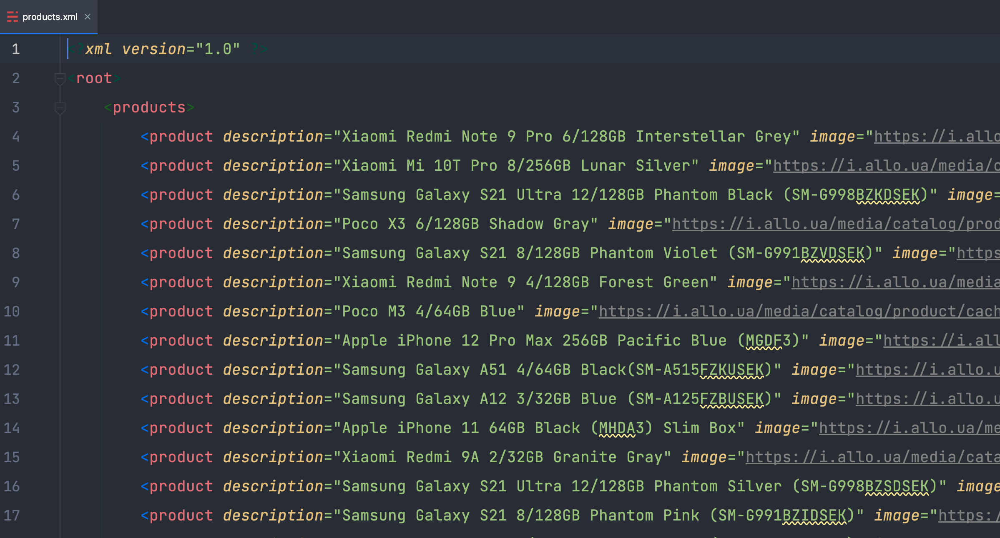

# Лабораторна робота №1
Вивчення базових операцій обробки XML-документів 

Виконав: **Пашинник Андрій Олександрович КП-81**

Варіант: **№15**

| Базова сторінка | Зміст завдання 2 | Адреса інтернет-магазину |
|-----------------|------------------|--------------------------|
| www.ua.igotoworld.com | Середня кількість графічних фрагментів | https://allo.ua | 

---
### Результати роботи

1. Результат парсингу 20 випадкових сторінок сбережений у файл [`data.xml`](data.xml).

2. Аналіз отриманих данних за варіантом:

3. Результат парсингу 20 опису та зображень 20 товарів сбережений у файл [`products.xml`](products.xml).

4. Результат трансормації даних 20 продуктів `xml` у `xhtml` сбережений у файл [`products.html`](products.html)

