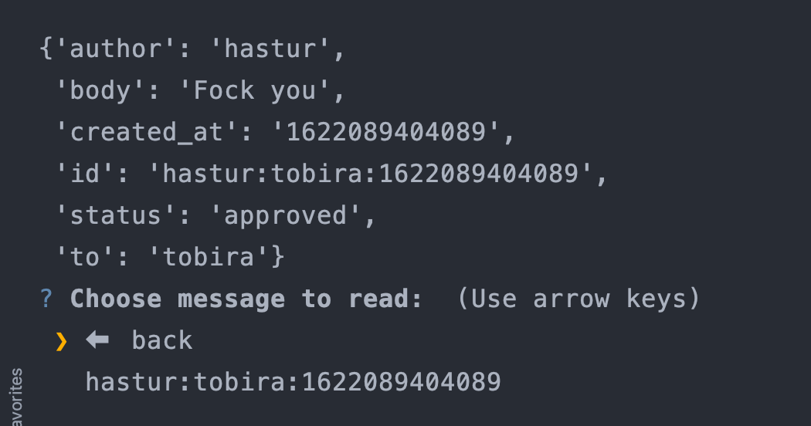

# Лабораторна робота No 2. 
## Практика використання серверу Redis

Виконав: **Пашинник Андрій Олександрович КП-81**

---
## Обгрунтування вибору структур даних в Redis
Для зберігання повідомлень використана хештаблиця, так як вона дозоволяє зберігати ключ та значення. 
Ключем виступає id повідомлення, значенням - ім'я користувача-відправника, 
користувача-отримувача, текст повідомлення.

Для зберігання користувачів використана множина (Set), 
так як нам не є важливий їх порядок, але є важливою швидкість доступу до них.

Для черги повідомлень використувоється List, 
так як нам є важливий порядок доданих записів, та час додавання та вилучення, 
який у випадку використання List є константним.

---

## Приклади роботи додатку

