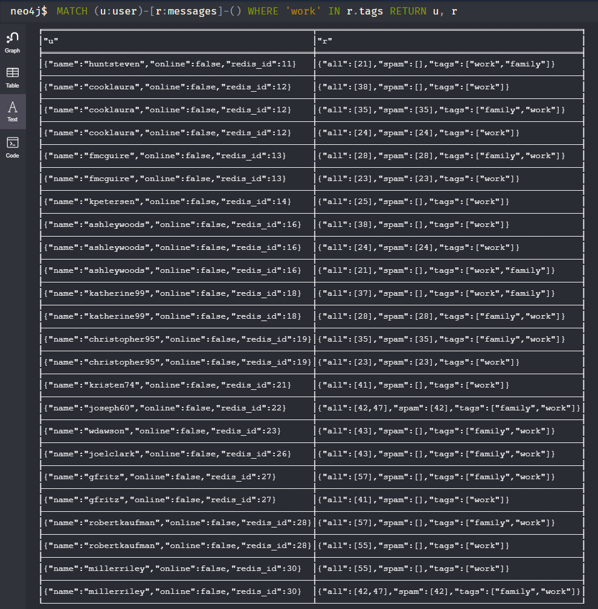
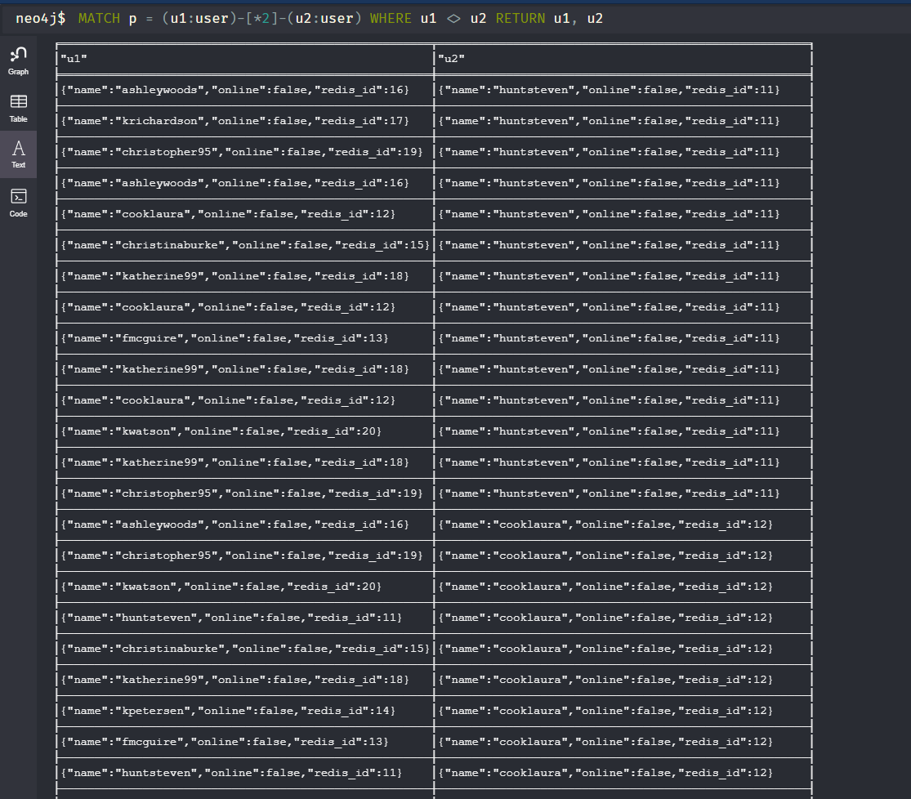
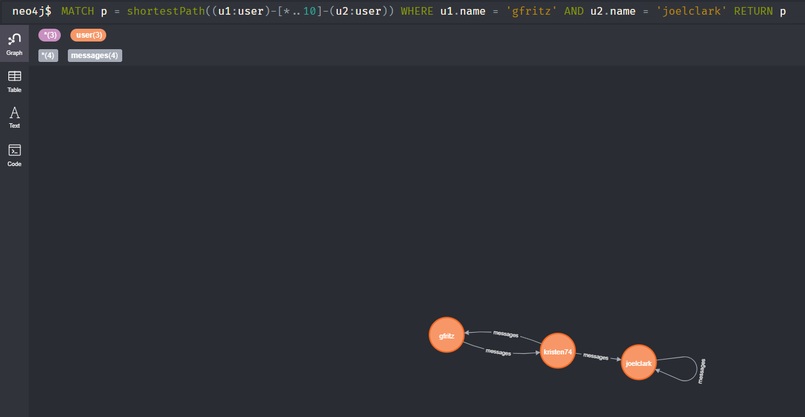
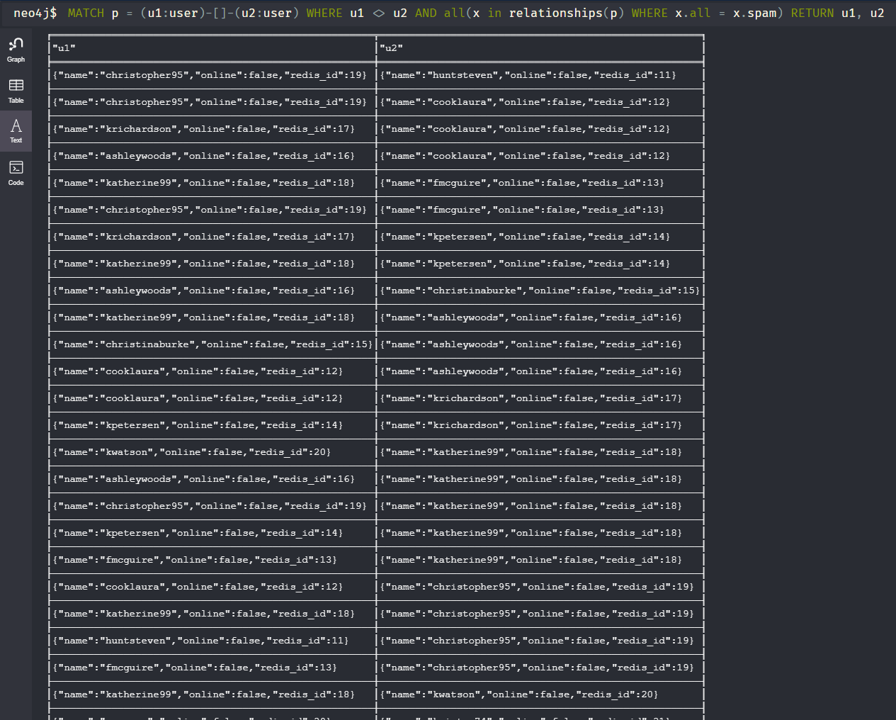
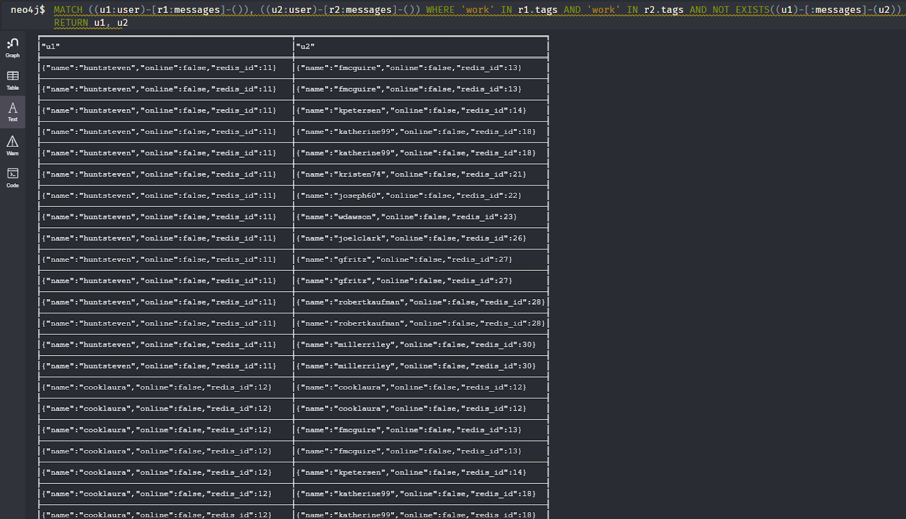

# Лабораторна робота No 3. 
## Практика використання графової бази даних Neo4J

Виконав: **Пашинник Андрій Олександрович КП-81**

## Приклади роботи

1. Задано список тегів (tags). Знайти всіх користувачів, що відправили або отримали повідомлення з набором тегів tags.
 

2. Задано довжину зв’язку N - кількість спільних повідомлень між користувачами. Знайти усі пари користувачів, що мають зв’язок довжиною N через відправлені або отримані повідомлення. Наприклад, якщо користувач A відправив повідомлення користувачу B, а B відправив повідомлення С, то довжина зв’язку між А і С є N=2.
 

3. Задано два користувача. Знайти на графі найкоротший шлях між ними через відправлені або отримані повідомлення.
 
   
4. Знайти авторів повідомлень, які пов’язані між собою лише повідомленнями, позначеними як “спам”.
 
   
5. Задано список тегів (tags). Знайти всіх користувачів, що відправили або отримали повідомлення з набором тегів tags, але ці користувачі не пов’язані між собою.
 